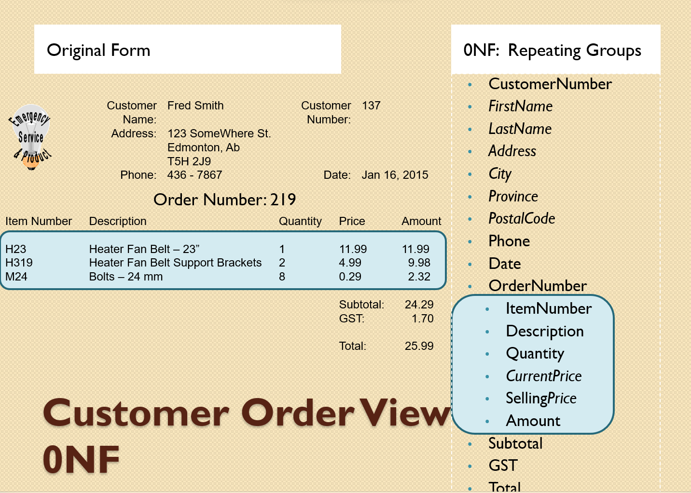

# Database Design

## Reading ERDs

## Normalization

> See the [PowerPoint](./ESP-1-Normalization.pptx) presentation and the [Normalization](./normalization.pdf) documents for an understanding of the steps/stages of normalization.

## Q&A

### What are Repeating Groups?

I got the following question from a student in class about Repeating Groups.

> Good evening, can you explain what repeating groups are? In the powerpoint you split the ItemNumber, Description, Quantity, Price, and Amount out of the larger table and I'm wondering how those are repeating?
>
> 

I gave this reply (which has been my best explanation to date).

> When thinking about what a **"Repeating Group"** is at **0NF**, think about the implication of each word separately ("Repeating" and "Group") and then combine the ideas into a unified description.
>
> They are "repeating" in the sense that those **meta-data items have *more than one value***. Thus, if we look at the `H23`, `H319` and `M24` values, we would say "each of those values can be labeled as an `Item Number`" and if we did that (actually put that label beside each value), then those labels would be "repeating".
>
> The other characteristic is the notion of a "group" of repeating meta-data. Because the data `H23`, `Heater Fan Belt - 23"`, `1`, `11.99`, `11.99` all represent different data about the same item (the Fan Belt), they function as a "group". Therefore, all the meta-data (labels) associated with those values also function as a group.
>
> So, when we **identify** the "Repeating Groups" in **0NF**, we are trying to distinguish an important characteristic of the data we are representing: That there exists for this set of meta-data several sets of values.
>
> This will also prepare us for the next stage of normalization: ***1NF: Separate Repeating Groups***.
